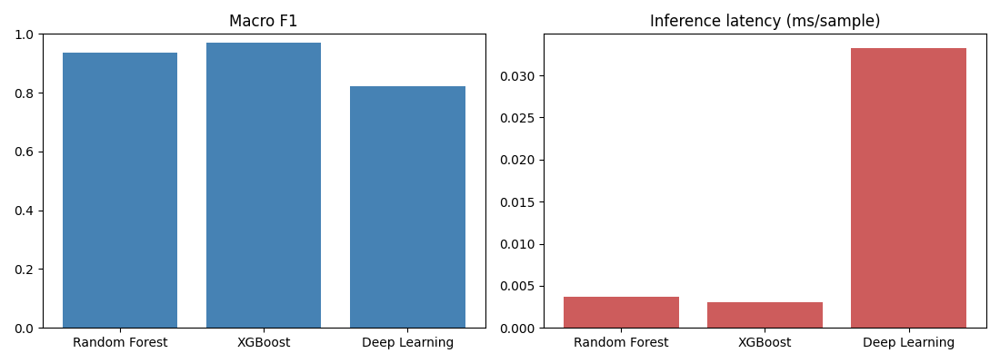
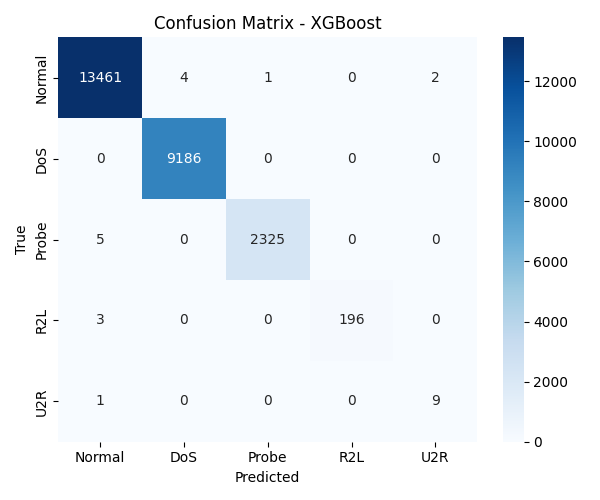

# Network Threat Detection System

A machine-learning intrusion detection system that ingests network flows, classifies traffic into five categories (benign + four attack types), and streams live detections to a real-time dashboard.

Three models — Random Forest, XGBoost, and a deep neural network — are trained and benchmarked on the NSL-KDD dataset, served through a FastAPI inference service, and visualized in a React dashboard. The full stack runs with a single `docker compose up`.


## What it does

```
PCAP / live traffic
        │
        ▼
   capture/  ──────────►  flow features (NSL-KDD schema)
                                  │
                                  ▼
                            api/ (FastAPI)
                       preprocessor + XGBoost
                            │            │
                     SQLite store   WebSocket /stream
                            │            │
                            ▼            ▼
                       dashboard/ (React + Recharts)
```

- **Capture** – groups packets into flows (5-tuple) and maps them to the model's feature schema; supports live sniffing or PCAP replay.
- **ML pipeline** – shared, persisted preprocessing (cleaning, encoding, scaling, SMOTE) so training and inference use identical transforms.
- **API** – FastAPI service exposing `/predict`, `/predict/batch`, `/health`, `/model/info`, and a `/stream` WebSocket; recent detections persisted to SQLite.
- **Dashboard** – live attack feed, attacks-over-time and by-type charts, and summary cards, updating in real time over WebSocket.

---

## Results

Three models were trained on `KDDTrain+` and evaluated two ways: on a held-out split of the training distribution, and on NSL-KDD's official `KDDTest+` set, which deliberately contains attack types **absent from training**.

### In-distribution (held-out split of KDDTrain+)

| Model | Accuracy | Macro-F1 | Latency (ms/sample) |
|---|---|---|---|
| Random Forest | 99.9% | 93.7% | 0.0037 |
| **XGBoost** | **99.9%** | **96.9%** | **0.0030** |
| Deep Learning (MLP) | 99.3% | 82.4% | 0.0333 |

### Hard benchmark (KDDTest+, novel attacks)

| Model | Accuracy | Macro-F1 |
|---|---|---|
| Random Forest | 74.1% | 51.5% |
| **XGBoost** | **77.8%** | **59.1%** |
| Deep Learning (MLP) | 77.2% | 57.5% |

**XGBoost wins on both benchmarks — and is also ~10× faster at inference than the deep network**, a reminder that gradient-boosted trees remain hard to beat on tabular data.

### The key finding

The ~19-point accuracy gap between the two benchmarks is the point. The models classify familiar attacks near-perfectly but degrade on novel ones: on `KDDTest+`, **R2L recall falls to ~0.08** and U2R stays weak. This is the central, well-documented NSL-KDD challenge — `KDDTest+` introduces attack types the models never saw in training, so there's little to generalize from. Reproducing this gap is a sign the evaluation is honest rather than leaking test information into training.





Full per-class metrics and all confusion matrices: [`docs/comparison.md`](docs/comparison.md).

---

## Tech stack

Python · scikit-learn · XGBoost · TensorFlow/Keras · imbalanced-learn · FastAPI · React (Vite) · Recharts · SQLite · Docker

---

## Project structure

```
network-threat-detection/
├── ml/
│   ├── data/             # NSL-KDD, CICIDS2017, and synthetic loaders
│   ├── preprocessing/    # shared, persisted preprocessing pipeline
│   ├── train/            # random_forest, xgboost_model, deep_model
│   └── evaluation/       # compare (in-dist) + holdout (KDDTest+)
├── capture/              # packet sniffer, PCAP replay, flow → feature mapper
├── api/                  # FastAPI service (main, schemas, db, Dockerfile)
├── dashboard/            # React + Vite dashboard
├── tests/                # pytest suite (pipeline + API)
├── data/                 # datasets (gitignored — see below)
├── models/               # trained artifacts (gitignored)
├── docs/                 # comparison report + figures
├── feed.py               # sends synthetic flows to the API for demos
└── docker-compose.yml
```

---

## Setup

```bash
# Python 3.10–3.12 (TensorFlow does not yet support 3.13)
py -3.10 -m venv .venv
.\.venv\Scripts\Activate.ps1        # Windows
# source .venv/bin/activate         # macOS / Linux
pip install -r ml/requirements.txt
```

## Datasets

Datasets are not committed (large / licensed). Without them, the pipeline falls back to synthetic data automatically, so the code runs out of the box.

- **NSL-KDD** — place `KDDTrain+.txt` and `KDDTest+.txt` in `data/nslkdd/`
- **CICIDS2017** *(optional)* — place the MachineLearningCVE CSVs in `data/cicids/`

NSL-KDD is available from the [Canadian Institute for Cybersecurity](https://www.unb.ca/cic/datasets/nsl.html) or public mirrors.

## Run

```bash
# 1. Train all three models
python -m ml.train.random_forest
python -m ml.train.xgboost_model
python -m ml.train.deep_model

# 2. Evaluate
python -m ml.evaluation.compare     # in-distribution split + figures
python -m ml.evaluation.holdout     # official KDDTest+ benchmark

# 3. Serve the API  (terminal 1)
python -m uvicorn api.main:app --reload

# 4. Dashboard  (terminal 2)
cd dashboard && npm install && npm run dev

# 5. Feed demo detections  (terminal 3)
python feed.py
```

API at `http://127.0.0.1:8000` (`/docs` for Swagger), dashboard at `http://localhost:5173`.

## Tests

```bash
python -m pytest -q
```

## Docker

```bash
docker compose up --build
```

> Train the models first — the API loads them at startup from the mounted `models/` volume.

---

## Future work

- **Cross-dataset generalization** — train on NSL-KDD, evaluate on CICIDS2017, to measure whether models learn attack behavior or dataset artifacts.
- **Explainability** — SHAP attributions on the XGBoost model to show which features drive each detection.
- **Live capture** — exercise the `capture/` layer end-to-end against real PCAP files.
