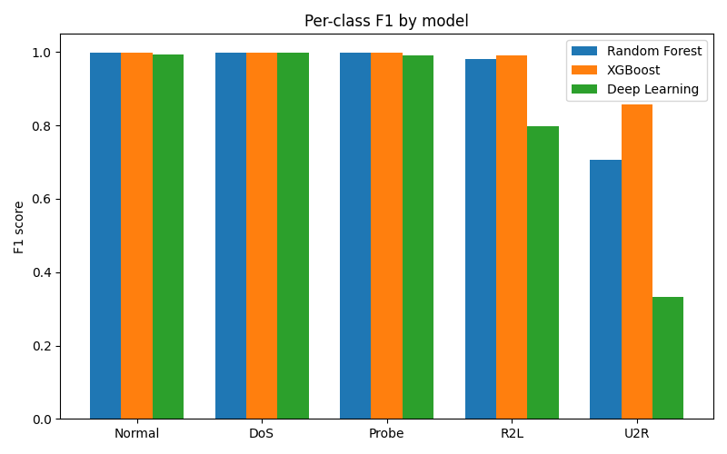
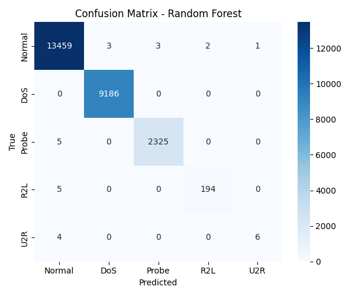

# Model Comparison: Random Forest vs XGBoost vs Deep Learning

Auto-generated by `ml/evaluation/compare.py`.

## Summary

| Model | Accuracy | Macro F1 | Latency (ms/sample) |
|---|---|---|---|
| Random Forest | 0.999 | 0.937 | 0.0037 |
| XGBoost | 0.999 | 0.969 | 0.0030 |
| Deep Learning | 0.993 | 0.824 | 0.0333 |

**Recommended production model: XGBoost** (highest macro F1; weigh latency and interpretability for your deployment).

## Per-class F1

## Summary charts

## Confusion matrices

### Random Forest

### XGBoost

### Deep Learning

## Trade-offs

- **Random Forest**: strong baseline, fast to train, interpretable (feature importance), robust to unscaled data.

- **XGBoost**: usually best accuracy/F1 on tabular intrusion data, handles imbalance via class weights, slightly less interpretable.

- **Deep Learning (MLP)**: scales to large data and complex patterns, but needs scaling, more tuning, less interpretable, and is often slower per inference on CPU.
